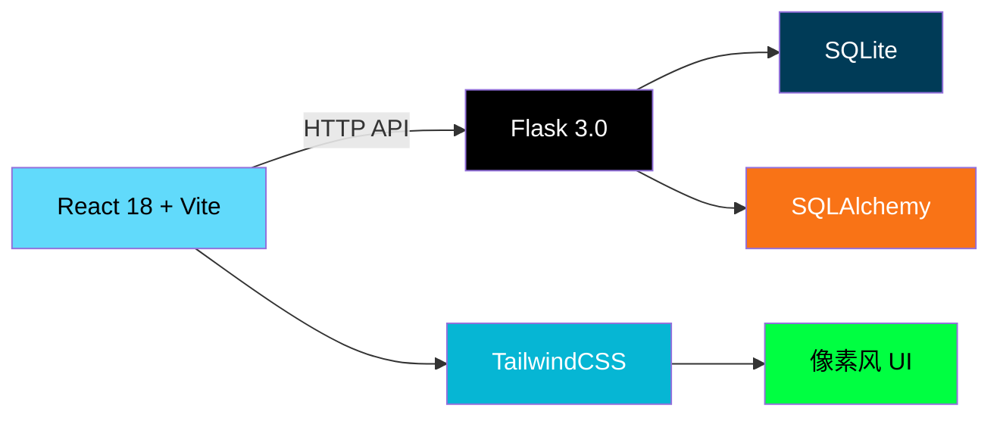

<div align="center">

# 🕹️ PixelMart

**OWASP Top 10 2021 安全测试靶场**

[](https://docker.com)
[](https://react.dev)
[](https://flask.palletsprojects.com)
[](LICENSE)

> 复古像素风线上商城，每个功能点对应一个 **OWASP Top 10 2021** 漏洞。  
> 在游戏化的探索中学习网络安全知识。


</div>

---

## ✨ 特色

| 特色 | 说明 |
|------|------|
| 🎮 **游戏化学习** | 像素风商城界面，每个功能点都是一个安全挑战 |
| 🚩 **10 大漏洞全覆盖** | OWASP Top 10 2021 全部类别，一个不少 |
| 🆓 **自由探索** | 无顺序限制，任意挑战，想打哪个打哪个 |
| 💡 **渐进式提示** | 模糊提示 → 弹窗确认 → 清晰显示，保护挑战乐趣 |
| 🏆 **Flag 提交中心** | 统一验证 + 进度追踪 + 徽章墙 |
| 🐳 **一键部署** | Docker Compose 启动，单容器部署 |

---


## 展示


## 🚀 快速启动

```bash
# 克隆仓库
git clone https://github.com/fb0sh/PixelMart.git
cd PixelMart

# 一键启动
docker compose up -d
```

打开浏览器访问 **http://localhost:8080** 🎉

| 服务 | 地址 | 说明 |
|------|------|------|
| 🕹️ PixelMart | http://localhost:8080 | 前端 + 后端（单容器） |
| 📖 WriteUp | [writeup.md](./writeup.md) | 完整攻略 |

---

## 🏁 10 个挑战一览

| ID | 漏洞类别 | 难度 | 场景 | Flag |
|----|---------|:----:|------|------|
| A01 | 越权访问 | ⭐ | 绕过权限访问管理面板 | `FloatCTF{...}` |
| A02 | 加密失效 | ⭐ | 解码身份令牌 | `FloatCTF{...}` |
| A03 | SQL 注入 | ⭐⭐ | 搜索框注入获取隐藏数据 | `FloatCTF{...}` |
| A04 | 不安全设计 | ⭐⭐ | 负价格购买天价商品 | `FloatCTF{...}` |
| A05 | 安全配置错误 | ⭐⭐ | 从备份文件破解管理员密码 | `FloatCTF{...}` |
| A06 | 脆弱组件 | ⭐⭐⭐ | 利用旧版 jQuery XSS 漏洞 | `FloatCTF{...}` |
| A07 | 认证失效 | ⭐ | 弱密码/逻辑漏洞登录 | `FloatCTF{...}` |
| A08 | 完整性失效 | ⭐⭐⭐ | GET 请求 CSRF 改密码 | `FloatCTF{...}` |
| A09 | 日志泄露 | ⭐⭐ | 未鉴权日志泄露敏感信息 | `FloatCTF{...}` |
| A10 | SSRF | ⭐⭐⭐ | 图片预览功能访问内部接口 | `FloatCTF{...}` |

> 💡 **提示**: Flag 格式为 `FloatCTF{...}`，在 [Flag 提交中心](http://localhost:8080/flag-submit) 验证。

---

## 🛠️ 技术栈



| 层级 | 技术 |
|------|------|
| 🎨 **前端** | React 18 + Vite + TailwindCSS + Press Start 2P 字体 |
| ⚙️ **后端** | Flask 3.0 + SQLAlchemy + SQLite |
| 🐳 **部署** | Docker Compose（开发模式热重载） |

---

## 📁 项目结构

```
PixelMart/
├── docker-compose.yml          # Docker 编排
├── README.md                   # 本文件
├── writeup.md                  # 完整攻略
│
├── backend/                    # Flask 后端
│   ├── Dockerfile
│   ├── requirements.txt
│   ├── run.py
│   └── app/
│       ├── __init__.py         # 应用初始化 + 路由注册
│       ├── models.py           # 数据库模型 + 种子数据
│       └── api/
│           ├── auth.py         # 登录/注册 (A02, A07)
│           ├── products.py     # 商品搜索 (A03 SQL注入)
│           ├── admin.py        # 管理面板 (A01, A08)
│           ├── cart.py         # 购物车结算 (A04 负价格)
│           ├── challenges.py   # 挑战列表 & Flag 验证
│           ├── config.py       # robots.txt & backup (A05)
│           ├── feedback.py     # 反馈表单 (A06 XSS)
│           ├── logs.py         # 系统日志 (A09)
│           ├── profile.py      # 个人中心 (A08 CSRF)
│           └── ssrf.py         # 图片预览 (A10 SSRF)
│
└── frontend/                   # React 前端
    ├── Dockerfile
    ├── package.json
    ├── vite.config.js
    ├── tailwind.config.js
    ├── index.html
    └── src/
        ├── main.jsx
        ├── App.jsx             # 路由 + 导航 + 状态管理
        ├── index.css           # 像素风全局样式
        └── views/
            ├── Home.jsx        # 首页
            ├── Shop.jsx        # 商城 (搜索框)
            ├── Challenges.jsx  # 挑战列表 (模糊提示)
            ├── FlagSubmit.jsx  # 🏁 Flag 提交中心
            ├── Login.jsx       # 登录/注册
            ├── Admin.jsx       # 管理面板
            ├── Profile.jsx     # 个人中心
            ├── Feedback.jsx    # 联系我们
            ├── Logs.jsx        # 系统日志
            └── Cart.jsx        # 购物车
```

---

## 🎯 玩法指南

### 基本流程

```
1. 进入商城 🛒     →   浏览商品、搜索、登录、购物
2. 发现漏洞 🔍     →   每个功能点都可能存在安全问题
3. 获取 Flag 🚩    →   成功利用漏洞后获得 Flag
4. 提交验证 ✅     →   在 Flag 提交中心验证
5. 收集徽章 🏆     →   集齐 10 个 Flag 获得全部徽章
```

### 线索来源

| 来源 | 说明 |
|------|------|
| 🔍 **页面源码** | 每个页面 HTML 注释中藏有线索 |
| 🖥️ **控制台** | 打开 F12 有彩蛋提示 |
| 📡 **网络请求** | 观察 API 请求和响应 |
| 🍪 **Cookie** | 检查 Cookie 中的信息 |
| 💡 **挑战提示** | 点击挑战卡片上的模糊提示 |

---

## 🖼️ 界面预览

### 首页
```
┌─────────────────────────────────────────┐
│  🕹️ PixelMart                            │
│  OWASP Top 10 2021 安全测试靶场          │
│                                          │
│  [🛒 进入商城]  [🏁 挑战列表]              │
├─────────────────────────────────────────┤
│  🔍 10 大漏洞  │  🎮 趣味探索  │  🏆 收集 │
│  全覆盖         │  像素风       │  Flag   │
└─────────────────────────────────────────┘
```

### Flag 提交中心
```
┌─────────────────────────────────────────┐
│  🏁 Flag 提交中心                        │
│                                          │
│  输入 Flag: [________________] [🚀 验证] │
│                                          │
│  ✅ A01 越权访问        🏆 已提交         │
│  ❌ A02 加密失效        ⬜ 未完成         │
│  ❌ A03 SQL注入         ⬜ 未完成         │
│  ...                                      │
│                                          │
│  进度: 1/10  ████░░░░░░░░░               │
│                                          │
│  🏅 已获得徽章: 🏅 🏅                    │
└─────────────────────────────────────────┘
```

---

## 🛡️ 漏洞详情

每个挑战的完整攻略请查看 [writeup.md](./writeup.md)，包含：

- ✅ 漏洞场景描述
- 🔍 攻击路径分析
- 💻 具体利用方法（含代码示例）
- 🚩 Flag
- 🔒 修复建议

---

## 🤝 贡献

欢迎提交 Issue 和 PR！如果你有新的挑战创意或改进建议：

1. Fork 本仓库
2. 创建特性分支 (`git checkout -b feature/amazing-idea`)
3. 提交改动 (`git commit -m 'Add amazing idea'`)
4. 推送到分支 (`git push origin feature/amazing-idea`)
5. 创建 Pull Request

---

## ⚠️ 免责声明

**本项目仅用于网络安全学习和教学目的。**

- 请勿将本项目中的技术用于非法用途
- 请勿在未经授权的系统上进行安全测试
- 作者不对任何滥用行为负责

---

<div align="center">

**PixelMart** — 在像素世界中学习安全 🎮🔒

[](https://github.com/fb0sh/PixelMart)
[](https://github.com/fb0sh/PixelMart)

</div>
